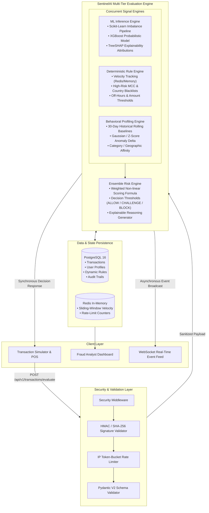

# SentinelAI System Architecture & Specification

## 1. Executive Summary
SentinelAI is a multi-layered, real-time transaction security platform designed for high-throughput, low-latency financial fraud detection. It seamlessly bridges machine learning intelligence (XGBoost + SHAP) with deterministic rule evaluation, behavioral deviation profiling, and rate-limiting security middleware.

---

## 2. Comprehensive System Architecture



---

## 3. End-to-End Transaction Lifecycle & Data Flow

```
1. User Initiates:
   Client (POS / Checkout Simulator) sends a transaction payload with headers:
   - X-Signature: HMAC-SHA256(payload, secret)
   - X-Client-IP / Client-Id

2. Security Gate:
   - Verifies HMAC signature integrity.
   - Applies rate-limiting (e.g., max 50 req/sec per IP).
   - Validates schema structure, type bounds, and regex constraints.

3. Parallel Signal Computation:
   a. ML Engine:
      - Encodes categorical features (Merchant Category Code, Country, Card Type).
      - Normalizes continuous variables (Amount, Hour of day, Distance from home).
      - XGBoost model predicts fraud probability P(Fraud).
      - Computes local SHAP values to extract the top positive and negative risk factors.
   b. Deterministic Rule Engine:
      - Checks instantaneous velocity: number of transactions in last 5m, 1h, 24h.
      - Checks amount thresholds (> $2,000 without prior history).
      - Checks forbidden/sanctioned countries and high-risk merchant categories.
   c. Behavioral Profiling Engine:
      - Fetches user 30-day mean spending and standard deviation.
      - Calculates amount Z-Score: (amount - mean) / std.
      - Checks deviation from historical spending hours and typical merchant categories.

4. Ensemble Risk Aggregation:
   The composite risk score is calculated via:
   RiskScore = w1 * (ML_Prob * 100) + w2 * (Rule_Score) + w3 * (Behavioral_Score)
   
   Decision thresholds:
   - RiskScore < 30  ──▶ ALLOW (Transaction approved)
   - 30 <= RiskScore < 75 ──▶ CHALLENGE (Trigger 2FA / OTP step-up verification)
   - RiskScore >= 75 ──▶ BLOCK (Immediate decline & high-severity fraud alert)

5. Persistence & Event Distribution:
   - Record stored in PostgreSQL (`transactions`, `risk_assessments`, `fraud_alerts`).
   - Push event over WebSocket to connected React fraud analyst dashboards.
   - Synchronous HTTP 200 response returned to POS simulator.
```

---

## 4. Component Responsibilities

### 4.1 Frontend Layer (`/frontend`)
- **Interactive POS / Checkout Simulator**: Allows submitting custom card transactions, testing valid and fraudulent edge cases, and running automated attack simulations (Card Testing attack, High-Value Midnight Spree, Rapid Velocity Blitz).
- **Fraud Analyst Live Dashboard**: Real-time ticker of evaluated transactions with color-coded risk badges.
- **Explainability Inspector**: Visualizes local SHAP waterfall charts showing exact contributing factors for any flagged transaction.
- **Rule Management UI**: Live toggle and threshold editor for business rules.

### 4.2 API & Ingestion Layer (`/backend/app/api`)
- **FastAPI Framework**: High performance async routing, automatic OpenAPI 3.0 documentation, and WebSocket connection management.
- **Security Middleware**: Centralized protection against injection attacks, invalid signatures, and DDoS/burst scraping.

### 4.3 Machine Learning Pipeline (`/ml_pipeline` & `/backend/app/services/ml_service.py`)
- **Pre-processing**: Robust scaling, missing value handling, one-hot/target encoding.
- **Class Imbalance Mitigation**: SMOTE / Class weight calibration for extreme class imbalance (typically 0.1% - 1% fraud rate).
- **Model**: XGBoost Classifier tuned for high PR-AUC (Precision-Recall Area Under Curve).
- **Interpretability**: TreeSHAP model outputting exact log-odds contributions per transaction.

### 4.4 Deterministic Rule Engine (`/backend/app/services/rule_service.py`)
- Configurable rules with dynamic enable/disable state.
- Supports velocity windows, location jumps (impossible travel velocity), and blacklist checks.

### 4.5 Behavioral Engine (`/backend/app/services/behavioral_service.py`)
- Rolling statistical aggregates (mean, standard deviation, max amount, typical active hours).
- Adaptive user profile updating post-settlement.

### 4.6 Persistence Layer (`/backend/app/models`)
- Relational integrity with SQLAlchemy ORM and PostgreSQL 16.
