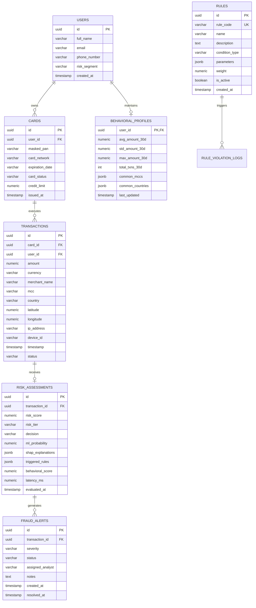

# SentinelAI Database Schema Specification

SentinelAI utilizes PostgreSQL 16 for relational integrity, time-indexed transaction storage, and audit logs.

---

## 1. Entity-Relationship Diagram

---

## 2. Table Schemas & Indexes

### 2.1 `transactions` Table
- `id` (UUID, Primary Key)
- `card_id` (UUID, Indexed)
- `user_id` (UUID, Indexed)
- `amount` (NUMERIC(12, 2), NOT NULL)
- `currency` (VARCHAR(3), Default 'USD')
- `merchant_name` (VARCHAR(150), NOT NULL)
- `mcc` (VARCHAR(4), NOT NULL)
- `country` (VARCHAR(2), NOT NULL)
- `latitude` (NUMERIC(9, 6))
- `longitude` (NUMERIC(9, 6))
- `ip_address` (VARCHAR(45))
- `device_id` (VARCHAR(100))
- `timestamp` (TIMESTAMP WITH TIME ZONE, NOT NULL, Indexed DESC)
- `status` (VARCHAR(20), e.g., 'APPROVED', 'DECLINED', 'CHALLENGED')

### 2.2 `risk_assessments` Table
- `id` (UUID, Primary Key)
- `transaction_id` (UUID, Unique, Foreign Key -> `transactions.id`)
- `risk_score` (NUMERIC(5, 2), NOT NULL) — 0.00 to 100.00
- `risk_tier` (VARCHAR(20)) — LOW, MEDIUM, HIGH, CRITICAL
- `decision` (VARCHAR(20)) — ALLOW, CHALLENGE, BLOCK
- `ml_probability` (NUMERIC(6, 5)) — 0.00000 to 1.00000
- `shap_explanations` (JSONB) — Feature contributions array
- `triggered_rules` (JSONB) — Array of violated rule IDs & descriptions
- `behavioral_score` (NUMERIC(6, 3)) — Anomaly Z-Score
- `latency_ms` (NUMERIC(7, 2)) — Pipeline execution time in ms
- `evaluated_at` (TIMESTAMP WITH TIME ZONE, NOT NULL)

### 2.3 `behavioral_profiles` Table
- `user_id` (UUID, Primary Key, Foreign Key -> `users.id`)
- `avg_amount_30d` (NUMERIC(12, 2), Default 0.00)
- `std_amount_30d` (NUMERIC(12, 2), Default 0.00)
- `max_amount_30d` (NUMERIC(12, 2), Default 0.00)
- `total_txns_30d` (INT, Default 0)
- `common_mccs` (JSONB) — Array of top MCCs
- `common_countries` (JSONB) — Array of ISO country codes
- `last_updated` (TIMESTAMP WITH TIME ZONE)
